<h1 align='center'> Projeto Final Módulo 3 - Resilia Educação - Grupo 1 </h1>
 

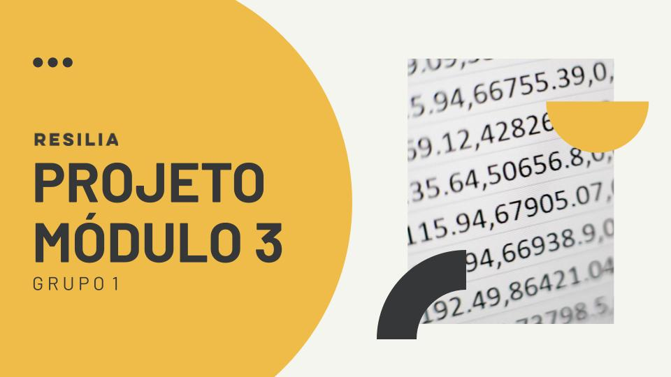

    
    

<h2 id='descricao'> Descrição </h2>

<h3 align='center'>
    :point_right: O objetivo deste projeto é aplicar os conhecimentos adquiridos ao longo do módulo 3 da Formação Web. Dev. Fullstack da Resilia Educação.
</h3>
  

    :books: O foco do módulo foi em nos apresentar os primeiros conceitos relacionados a bancos de dados, principalmente relacionais, e como utilizar a linguagem SQL
    para construir e manipular um banco de dados - criar a database, adicionar suas tabelas declarando suas colunas e tipos de dados e populá-las com informações,         alterar dados dos registros de tabelas e realizar consultas e filtragens de dados.

    Com base nesses conhecimentos, deveríamos escolher um banco de dados para ser o objeto do nosso trabalho e, após analisá-lo, pensar em perguntas que 
    poderíamos responder com os dados disponíveis. 

 

 
    :white_check_mark: Optamos por trabalhar com o banco de dados da Steam, e abaixo estão as perguntas que elaboramos para serem extraídas e analisadas:

    
 
      1. Quantos jogos cada desenvolvedora lançou?   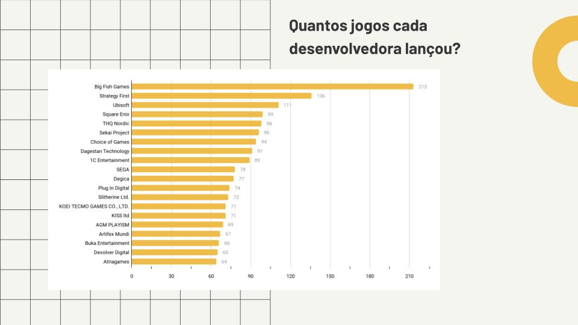
      2. Qual a média de preço dos jogos?   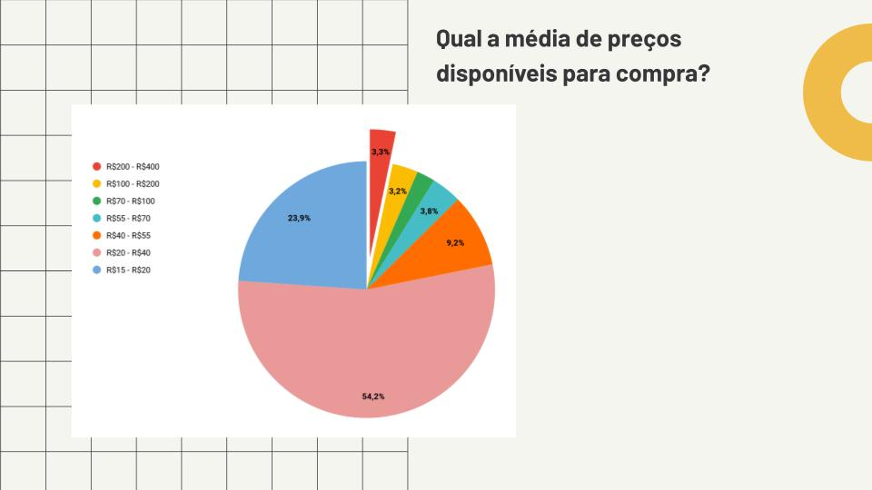
      3. Qual gênero tem mais jogos?   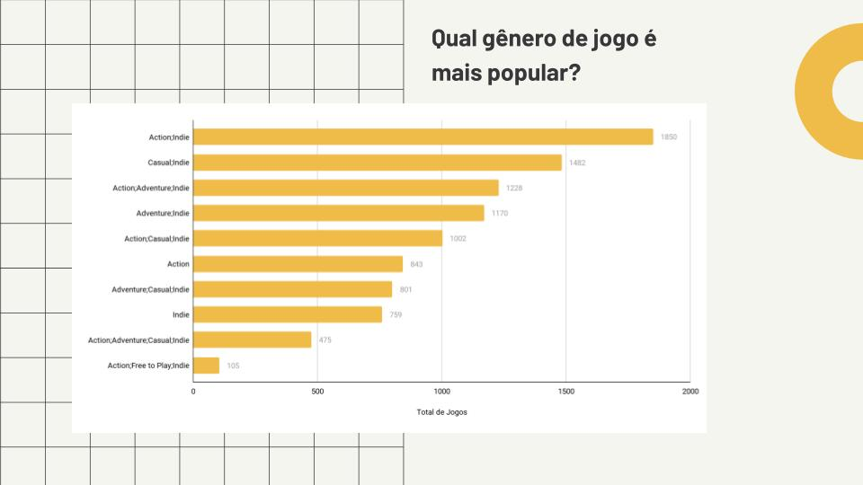
      4. Quais jogos disponibilizam e-mail de suporte? Esses jogos possuem mais avaliações positivas ou negativas?   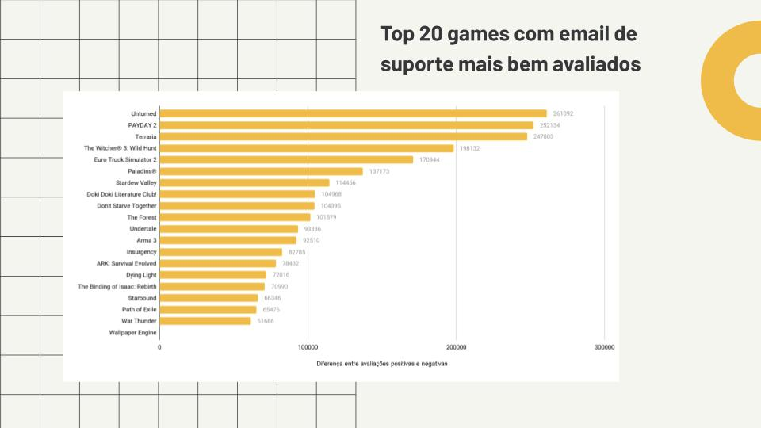
      5. Quais os 10 jogos melhor avaliados?   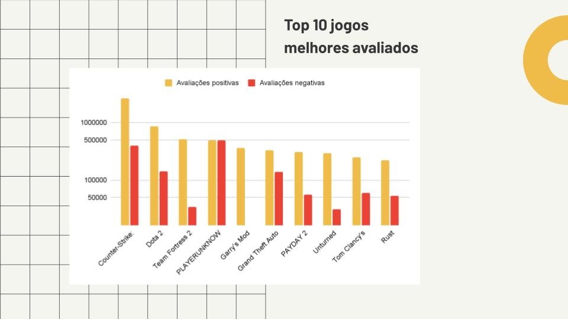 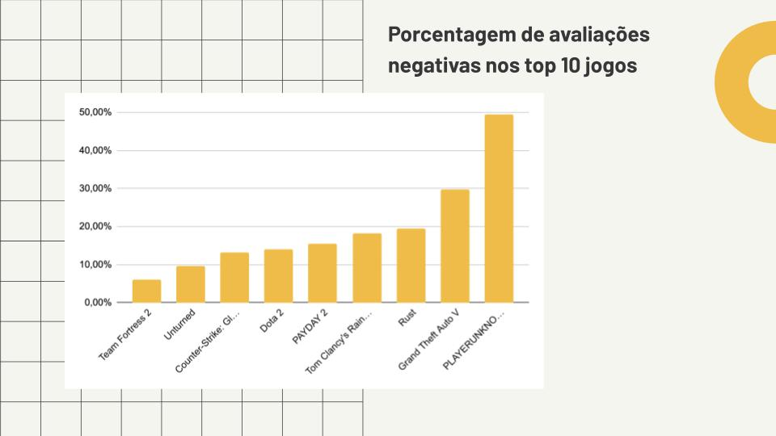
      6. Qual média de tempo jogado de cada um?   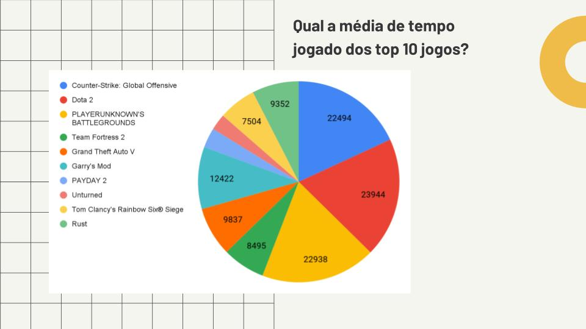
      7. Quais os 10 jogos pior avaliados?   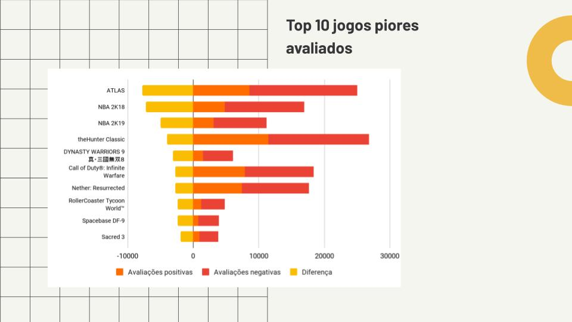
      8. Quais jogos que possuem requisitos recomendados considerados mid-end?   
      9. Quais os 10 jogos mais bem avaliados que possuem a tag "RPG", "FPS" e "racing".   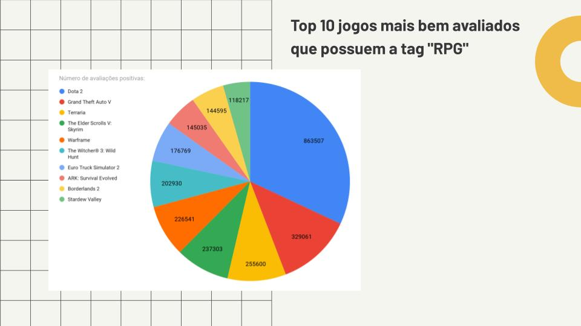 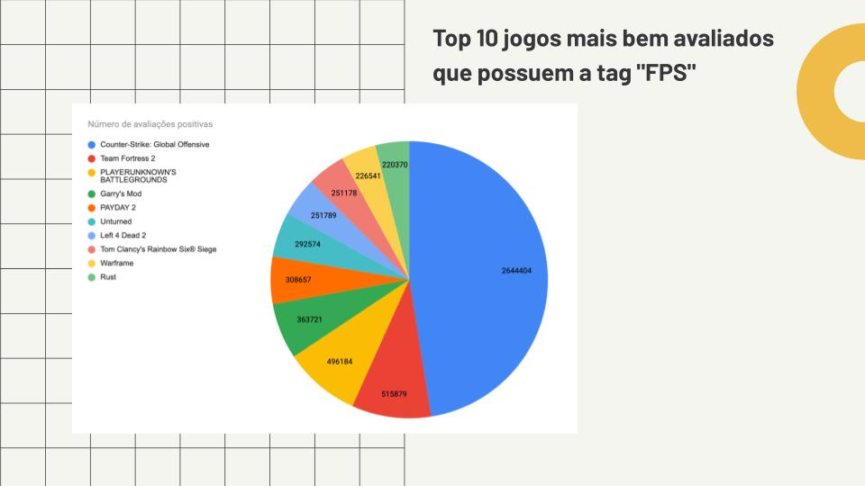 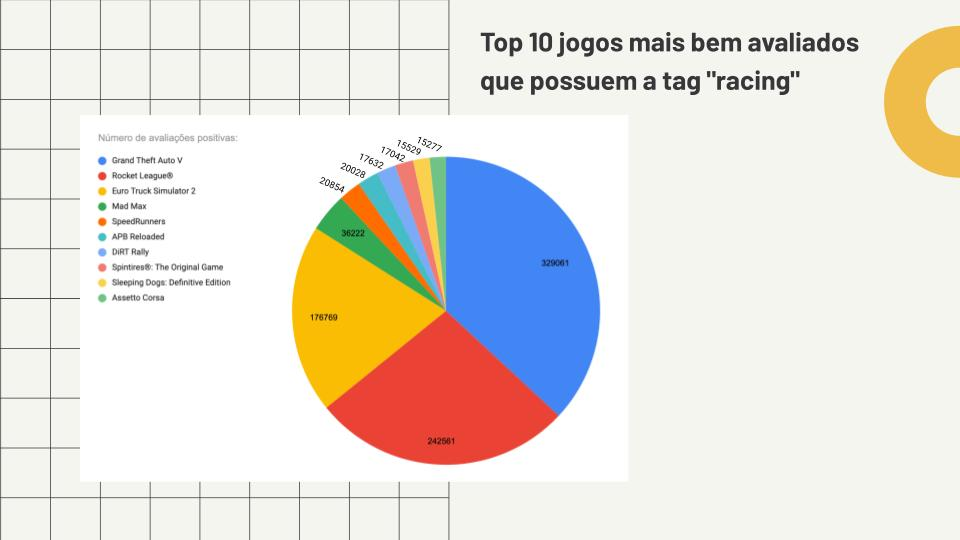
      10. Quantos jogos possuem modo A - Single Player, B - Multi-Player e C - Co-op? 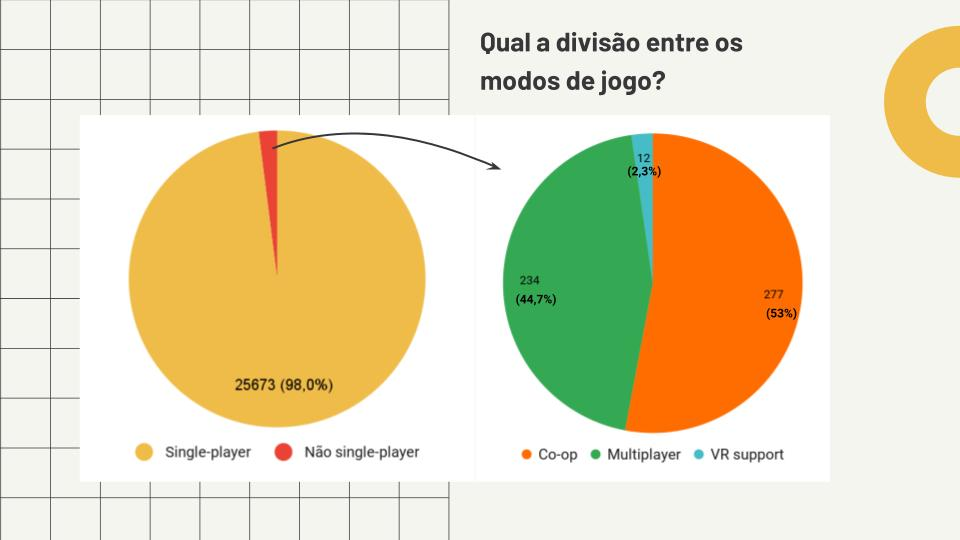
    

 

    <h2> :clipboard: Índice </h2>
    <ul>
        <a href='#descricao'> :pushpin: Descrição </a>  
        <a href='#funcionalidades'> :pushpin: Funcionalidades </a>  
        <a href='#preReqs'> :pushpin: Pré-requisitos </a>  
        <a href='#rodar'> :pushpin: Rodando projeto </a>  
        <a href='#tecnologias'> :pushpin: Tecnologias </a>  
        <a href='#contribuidores'> :pushpin: Contribuidores </a>
    </ul>

 

<h2 id='funcionalidades'> :wrench: Funcionalidades do Projeto </h2>

    As funcionalidades do projeto são referentes às queries que elaboramos para responder às perguntas listadas acima. Assim, cada querie pode ser considerada uma         funcionalidade.

 

    

        Na imagem abaixo, por exemplo, temos uma query que responde à pergunta 10 - Quantos jogos possuem modo A - Single Player, B - Multi-Player e C - Co-op?:
    

    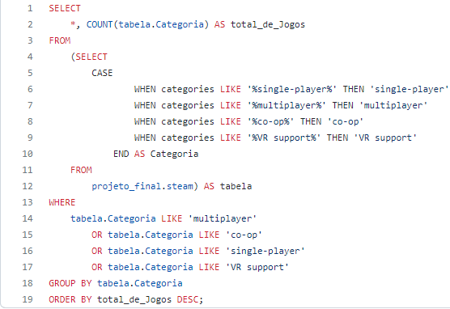

 

<h2 id='preReqs'> :desktop_computer: Pré-requisitos </h2>

    

        Para conseguir rodar as queries e visualizar os dados, você precisará ter instaladas no seu computador as seguintes ferramentas:
    

    <ul>
        <li> Git: (https://git-scm.com) </li>
        <li> MySQL: (https://dev.mysql.com/downloads/) (principalmente o MySQL Workbench e MySQL Server) </li>
    </ul>

 

<h2 id='rodar'> :runner: Rodando o Projeto </h2>

<ul> 
    
 :arrow_right: Realize o clone deste repositório com o comando $ git clone https://github.com/juliapradob/projeto-modulo3.git 

    
 :arrow_right: Inicie o MySQL Workbench 

    
 :arrow_right: Vá até o diretório em que clonou os arquivos do projeto e abra a pasta 'schema' 

    
 :arrow_right: Execute o arquivo 'steam_schema.sql' no MySQL Workbench para criar a database e suas tabelas

    
 :arrow_right: Depois, vá até a pasta 'data' e execute no Workbench cada um dos arquivos, para popular as tabelas criadas 

    
 :arrow_right: Finalmente, acesse a pasta 'queries' e execute aquelas que tiver curiosidade! 
    
</ul>
 

<h2 id='tecnologias'> :hammer_and_wrench: Tecnologias </h2>

 Utilizamos as seguintes ferramentas para construir o projeto: 

- [MySQL](https://www.mysql.com/)
- [VS Code](https://code.visualstudio.com/)
 

<h2 id='contribuidores'> Contribuidores </h2>

<table align='center'>
    <tr>
        <td align="center">
             
            
                <b><a href='https://github.com/AllanBarbozaG'> Allan Barboza </a></b>
            
        </td>
        <td align="center">
             
            
                <b><a href='https://github.com/devhelderlrs'> Helder Lucas </a></b>
            
        </td>
        <td align="center">
             
            
                <b><a href='https://github.com/lipeqalves'> Filipe Alves </a></b>
            
        </td>
        <td align="center">
             
            
                <b><a href='https://github.com/juliapradob'> Julia Prado </a></b>
            
        </td>
    </tr>
</table>

